# 프로젝트 명

<a href="https://soat.kr/"></a>

SO@ : 소공연에서 만나요

## 배포 링크 🔗

https://soat.kr/

- 테스트 계정

```
# 예매 회원
id : test@email.com
pw : test1234!

# 공연 관리자 회원
id : test2@email.com
pw : test1234!
```

## 프로젝트 소개 🗣️

### 프로젝트 목표

현재 많은 소극장 및 소공연에서는 예매 절차를 Google Forms와 같은 간단한 도구를 통해 진행하고 있습니다.
이는 운영자와 관람객 모두에게 번거로움과 예약 관리의 비효율성을 초래합니다.

본 프로젝트는 이러한 불편함을 해소하고자, 소극장 및 소공연을 위한 전용 예매 플랫폼을 기획하였습니다.
보다 직관적이고 효율적인 예매 환경을 제공함으로써, 공연 관리자는 손쉽게 예약을 관리하고 예매 회원은 간편하게 티켓을 예매할 수 있도록 돕는 것을 목표로 합니다.

### 프로젝트 기능

- 로그인(로그아웃) / 회원가입(탈퇴) 기능
- 검색 기능 (공연 검색, 카테고리 검색)
- 예매 회원
  - 공연 예매 / 조회 / 취소 기능
    - 예매 QR 티켓 확인
  - 관람한 공연 한줄평 작성 / 수정 / 삭제 기능
  - 마이페이지 회원 조회/수정 기능
- 공연 관리자 회원
  - 공연 등록 / 조회 / 종료 기능
    - 등록된 공연 조회
    - 공연별 예약 현황 관리 / 조회
  - 예매 QR 티켓 검증 기능
  - 관리자 페이지 회원 수정 기능
- admin 회원 (UI 구현 완료)
  - 회원 조회 및 상태 관리 (예매 회원 / 공연 관리자 회원 / 관리자 )
    - 신규 소극장 관리자 승인
  - 공연 조회 및 상태 관리
  - 한줄평 조회 및 상태 관리
  - 배너 관리
  - 이용약관 / 개인정보 처리방침 관리
  - 서비스 점검 모드 설정

## 팀원 소개 🌟

|                                                          [팀장] 김지훈                                                           |                                                                        [FE] 김예원                                                                        |                                                                        [FE] 윤시운                                                                        |                                                                        [FE] 이휘경                                                                        |                                                           [FE] 하진희                                                            |
| :------------------------------------------------------------------------------------------------------------------------------: | :-------------------------------------------------------------------------------------------------------------------------------------------------------: | :-------------------------------------------------------------------------------------------------------------------------------------------------------: | :-------------------------------------------------------------------------------------------------------------------------------------------------------: | :------------------------------------------------------------------------------------------------------------------------------: |
|  |  |  |  |  |
|                                              [김지훈](https://github.com/jihun-io)                                               |                                                           [김예원](https://github.com/yewonni)                                                            |                                                          [윤시운](https://github.com/siwoon1602)                                                          |                                                         [이휘경](https://github.com/LeeHwiGyoung)                                                         |                                              [하진희](https://github.com/jini0012)                                               |

## 목차 📜

- [개발환경](#developmentEnviroment)
- [프로젝트 기간](#period)
- [프로젝트 폴더 구조](#directory)
- [UI](#ui)
- [기능](#function)
- [트러블 슈팅](#troubleShooting)

## <a name="developmentEnvironment"></a> 개발 환경 🖥️

### 사용기술

#### 프레임 워크


#### 라이브러리

   


#### 스타일 라이브러리

   

#### devOps


### 협업 환경


## <a name="period"></a>프로젝트 기간 🚩

#### 1차 : 2025.02.05 ~ 2025.04.30

- 협업 및 소통 💬

  - 주 2~3회 Discord에서 회의 진행
  - Confluence에 회의록 작성 관리
  - 프로젝트 관련 주요 공지 및 알림은 Slack 을 통해 공유

- 개발 프로세스🔄

  - 브랜치 전략

    - main : 배포용 브랜치
    - dev : 개발 통합 브랜치
    - 페이지명 : 페이지별 개발 브랜치

  - merge 정책
    - 초기 폴더 구조 확립단계까지는 정기적으로 회의 진행 시 함께 merge 진행
    - 기능 고도화 단계 시 Pull Request를 통해 병합 진행
  - 작업 관리
    - Jira를 통한 이슈 및 작업 관리(Slack과 연동하여 알림)
    - PR을 통한 코드 병합 진행

- 개발 컨벤션 📝

  - 코드 스타일 : Prettier Extension 적용
  - 네이밍 컨벤션

    - 폴더명 : camelCase / 단, 라우더 URL (src/app 내 폴더명)은 모두 소문자로 작성
    - 일반 파일명 : camelCase
    - 컴포넌트(TSX) 명 : PascalCase
    - 환경변수 : UPPER_SNAKE_CASE
    - 변수명 : camelCase
      - 복수 객체 : 변수명 + `s`
      - 배열 : 변수명 + `List`
      - Map/Set : 변수명 + `Map`/`Set`
      - 함수 : `function` 키워드로 선언
    - CSS 클래스명 (TailwindCSS 를 메인으로 사용하며, Styled-Component는 부가적으로 코드 최하단에 사용)
      - Tailwind CSS : kebab-case
      - Styled-Component : camelCase

  - Git 컨벤션 : 커밋 메세지를 `[add/del/edit/fix/cmt] 상세 내용` 과 같이 작성
    - add : 파일/코드 추가
    - edit : 파일/코드 수정
    - del : 파일/코드 삭제
    - fix : 버그 수정
    - cmt : 주석 추가 / 수정 / 삭제 ([cmt/add]와 같이 작성)
  - 주석 컨벤션 : 기능 상단에 작성하며, 최대한 자세하게 작성
  - TypeScript 컨벤션
    - 타입 선업 시 type 보다 interface 위주로 작성하고 파일은 별도로 관리
    - interface명 : PascalCase

#### 2차 (admin 개발) : 2025.05.07 ~ 진행 예정

## <a name="directory"></a>프로젝트 폴더 구조 📁

<details>
<summary>프로젝트 폴더 구조</summary>

```
📦src
 ┣ 📂app
 ┃ ┣ 📂account
 ┃ ┃ ┣ 📂edit
 ┃ ┃ ┃ ┗ 📜page.tsx
 ┃ ┃ ┣ 📂mybook
 ┃ ┃ ┃ ┣ 📂[bookId]
 ┃ ┃ ┃ ┃ ┗ 📜page.tsx
 ┃ ┃ ┃ ┗ 📜page.tsx
 ┃ ┃ ┗ 📜page.tsx
 ┃ ┣ 📂admin
 ┃ ┃ ┣ 📂(routes)
 ┃ ┃ ┃ ┣ 📂banner-list
 ┃ ┃ ┃ ┃ ┣ 📜BannerDisplayOrder.tsx
 ┃ ┃ ┃ ┃ ┗ 📜page.tsx
 ┃ ┃ ┃ ┣ 📂maintenance-mode
 ┃ ┃ ┃ ┃ ┗ 📜page.tsx
 ┃ ┃ ┃ ┣ 📂performance-list
 ┃ ┃ ┃ ┃ ┗ 📜page.tsx
 ┃ ┃ ┃ ┣ 📂review-list
 ┃ ┃ ┃ ┃ ┗ 📜page.tsx
 ┃ ┃ ┃ ┣ 📂site-admin-list
 ┃ ┃ ┃ ┃ ┗ 📜page.tsx
 ┃ ┃ ┃ ┣ 📂terms-privacy-settings
 ┃ ┃ ┃ ┃ ┗ 📜page.tsx
 ┃ ┃ ┃ ┣ 📂theater-admin-approval
 ┃ ┃ ┃ ┃ ┗ 📜page.tsx
 ┃ ┃ ┃ ┗ 📂theater-admin-users
 ┃ ┃ ┃ ┃ ┗ 📜page.tsx
 ┃ ┃ ┣ 📜GeneralUsers.tsx
 ┃ ┃ ┗ 📜page.tsx
 ┃ ┣ 📂api
 ┃ ┃ ┣ 📂account
 ┃ ┃ ┃ ┣ 📂book
 ┃ ┃ ┃ ┃ ┣ 📂[bookId]
 ┃ ┃ ┃ ┃ ┃ ┗ 📜route.ts
 ┃ ┃ ┃ ┃ ┗ 📜route.ts
 ┃ ┃ ┃ ┣ 📂delete
 ┃ ┃ ┃ ┃ ┗ 📜route.ts
 ┃ ┃ ┃ ┣ 📂me
 ┃ ┃ ┃ ┃ ┗ 📜route.ts
 ┃ ┃ ┃ ┗ 📂password
 ┃ ┃ ┃ ┃ ┗ 📜route.ts
 ┃ ┃ ┣ 📂admin
 ┃ ┃ ┃ ┣ 📂account
 ┃ ┃ ┃ ┃ ┗ 📜route.ts
 ┃ ┃ ┃ ┣ 📂theater
 ┃ ┃ ┃ ┃ ┗ 📂approval
 ┃ ┃ ┃ ┃ ┃ ┣ 📂decrypt
 ┃ ┃ ┃ ┃ ┃ ┃ ┗ 📜route.ts
 ┃ ┃ ┃ ┃ ┃ ┣ 📂[accountId]
 ┃ ┃ ┃ ┃ ┃ ┃ ┗ 📜route.ts
 ┃ ┃ ┃ ┃ ┃ ┗ 📜route.ts
 ┃ ┃ ┃ ┗ 📂users
 ┃ ┃ ┃ ┃ ┗ 📜route.ts
 ┃ ┃ ┣ 📂auth
 ┃ ┃ ┃ ┣ 📂email-verification
 ┃ ┃ ┃ ┃ ┣ 📂verify
 ┃ ┃ ┃ ┃ ┃ ┗ 📜route.ts
 ┃ ┃ ┃ ┃ ┗ 📜route.ts
 ┃ ┃ ┃ ┣ 📂signup
 ┃ ┃ ┃ ┃ ┗ 📜route.ts
 ┃ ┃ ┃ ┗ 📂[...nextauth]
 ┃ ┃ ┃ ┃ ┗ 📜route.ts
 ┃ ┃ ┣ 📂enrollment
 ┃ ┃ ┃ ┗ 📜route.ts
 ┃ ┃ ┣ 📂manager
 ┃ ┃ ┃ ┣ 📂edit
 ┃ ┃ ┃ ┃ ┗ 📜route.ts
 ┃ ┃ ┃ ┣ 📂performance
 ┃ ┃ ┃ ┃ ┣ 📂[performId]
 ┃ ┃ ┃ ┃ ┃ ┣ 📂delete
 ┃ ┃ ┃ ┃ ┃ ┃ ┗ 📜route.ts
 ┃ ┃ ┃ ┃ ┃ ┗ 📂end
 ┃ ┃ ┃ ┃ ┃ ┃ ┗ 📜route.ts
 ┃ ┃ ┃ ┃ ┗ 📜route.ts
 ┃ ┃ ┃ ┗ 📂verify-ticket
 ┃ ┃ ┃ ┃ ┗ 📂[reservationId]
 ┃ ┃ ┃ ┃ ┃ ┗ 📜route.ts
 ┃ ┃ ┣ 📂performance
 ┃ ┃ ┃ ┣ 📂search
 ┃ ┃ ┃ ┃ ┗ 📜route.ts
 ┃ ┃ ┃ ┣ 📂[performId]
 ┃ ┃ ┃ ┃ ┗ 📜route.ts
 ┃ ┃ ┃ ┗ 📜route.ts
 ┃ ┃ ┣ 📂reservation
 ┃ ┃ ┃ ┣ 📂book
 ┃ ┃ ┃ ┃ ┣ 📂[reservationId]
 ┃ ┃ ┃ ┃ ┃ ┗ 📜route.ts
 ┃ ┃ ┃ ┃ ┗ 📜route.ts
 ┃ ┃ ┃ ┗ 📂update-seat
 ┃ ┃ ┃ ┃ ┗ 📜route.ts
 ┃ ┃ ┣ 📂reviews
 ┃ ┃ ┃ ┗ 📜route.ts
 ┃ ┃ ┗ 📜firebaseAdmin.ts
 ┃ ┣ 📂detail
 ┃ ┃ ┗ 📂[performId]
 ┃ ┃ ┃ ┗ 📜page.tsx
 ┃ ┣ 📂enrollment
 ┃ ┃ ┣ 📂edit
 ┃ ┃ ┃ ┗ 📂[performId]
 ┃ ┃ ┃ ┃ ┗ 📜page.tsx
 ┃ ┃ ┗ 📜page.tsx
 ┃ ┣ 📂fonts
 ┃ ┃ ┣ 📜GeistMonoVF.woff
 ┃ ┃ ┣ 📜GeistVF.woff
 ┃ ┃ ┗ 📜PretendardVariable.woff2
 ┃ ┣ 📂join
 ┃ ┃ ┣ 📜JoinForm.tsx
 ┃ ┃ ┣ 📜JoinGreeting.tsx
 ┃ ┃ ┗ 📜page.tsx
 ┃ ┣ 📂login
 ┃ ┃ ┣ 📜LoginContent.tsx
 ┃ ┃ ┗ 📜page.tsx
 ┃ ┣ 📂logout
 ┃ ┃ ┗ 📜page.tsx
 ┃ ┣ 📂manager
 ┃ ┃ ┣ 📂edit
 ┃ ┃ ┃ ┗ 📜page.tsx
 ┃ ┃ ┣ 📂performance
 ┃ ┃ ┃ ┣ 📂[performId]
 ┃ ┃ ┃ ┃ ┗ 📜page.tsx
 ┃ ┃ ┃ ┗ 📜page.tsx
 ┃ ┃ ┣ 📂ticket
 ┃ ┃ ┃ ┗ 📜page.tsx
 ┃ ┃ ┗ 📜page.tsx
 ┃ ┣ 📂performances
 ┃ ┃ ┣ 📂booking
 ┃ ┃ ┃ ┗ 📜page.tsx
 ┃ ┃ ┗ 📂upcoming
 ┃ ┃ ┃ ┗ 📜page.tsx
 ┃ ┣ 📂reservation
 ┃ ┃ ┗ 📂[showId]
 ┃ ┃ ┃ ┗ 📜page.tsx
 ┃ ┣ 📂search
 ┃ ┃ ┗ 📜page.tsx
 ┃ ┣ 📂_demo
 ┃ ┃ ┣ 📂admin
 ┃ ┃ ┃ ┗ 📜page.tsx
 ┃ ┃ ┣ 📂designs
 ┃ ┃ ┃ ┗ 📜page.tsx
 ┃ ┃ ┣ 📂detail
 ┃ ┃ ┃ ┗ 📂[performId]
 ┃ ┃ ┃ ┃ ┗ 📜page.tsx
 ┃ ┃ ┣ 📂map
 ┃ ┃ ┃ ┗ 📜page.tsx
 ┃ ┃ ┣ 📂onsnapshottest
 ┃ ┃ ┃ ┗ 📜page.tsx
 ┃ ┃ ┣ 📂seats
 ┃ ┃ ┃ ┣ 📂generator
 ┃ ┃ ┃ ┃ ┗ 📜page.tsx
 ┃ ┃ ┃ ┗ 📂selector
 ┃ ┃ ┃ ┃ ┗ 📜page.tsx
 ┃ ┃ ┣ 📂session
 ┃ ┃ ┃ ┗ 📜page.tsx
 ┃ ┃ ┗ 📂ticket
 ┃ ┃ ┃ ┗ 📜page.tsx
 ┃ ┣ 📜favicon.ico
 ┃ ┣ 📜globals.css
 ┃ ┣ 📜layout.tsx
 ┃ ┣ 📜not-found.tsx
 ┃ ┗ 📜page.tsx
 ┣ 📂auth
 ┃ ┣ 📜authOptions.ts
 ┃ ┗ 📜Provider.tsx
 ┣ 📂components
 ┃ ┣ 📂account
 ┃ ┃ ┣ 📜MyReservation.tsx
 ┃ ┃ ┣ 📜ReservationDetail.tsx
 ┃ ┃ ┣ 📜ReservationList.tsx
 ┃ ┃ ┣ 📜ReservationListData.tsx
 ┃ ┃ ┣ 📜UserInfo.tsx
 ┃ ┃ ┣ 📜UserInfoItem.tsx
 ┃ ┃ ┣ 📜UserInfoUpdate.tsx
 ┃ ┃ ┗ 📜ViewAllBooking.tsx
 ┃ ┣ 📂admin
 ┃ ┃ ┣ 📜 QueryButton.tsx
 ┃ ┃ ┣ 📜AdminHeader.tsx
 ┃ ┃ ┣ 📜AdminMain.tsx
 ┃ ┃ ┣ 📜AdminMenu.tsx
 ┃ ┃ ┣ 📜AdminMenuItem.tsx
 ┃ ┃ ┣ 📜AdminSearchInput.tsx
 ┃ ┃ ┣ 📜BannerDragAndDrop.tsx
 ┃ ┃ ┣ 📜BannerListTable.tsx
 ┃ ┃ ┣ 📜BannerModify.tsx
 ┃ ┃ ┣ 📜BannerRegister.tsx
 ┃ ┃ ┣ 📜GeneralUserForm.tsx
 ┃ ┃ ┣ 📜GeneralUsersTable.tsx
 ┃ ┃ ┣ 📜Hamburger.tsx
 ┃ ┃ ┣ 📜JoinTypeModal.tsx
 ┃ ┃ ┣ 📜ListTitle.tsx
 ┃ ┃ ┣ 📜NewTheaterAdminForm.tsx
 ┃ ┃ ┣ 📜PerformanceForm.tsx
 ┃ ┃ ┣ 📜PerformanceTable.tsx
 ┃ ┃ ┣ 📜PrivacyPage.tsx
 ┃ ┃ ┣ 📜ReviewForm.tsx
 ┃ ┃ ┣ 📜ReviewTable.tsx
 ┃ ┃ ┣ 📜SiteAdminModify.tsx
 ┃ ┃ ┣ 📜SiteAdminRegister.tsx
 ┃ ┃ ┣ 📜SiteAdminTable.tsx
 ┃ ┃ ┣ 📜SubTabDescription.tsx
 ┃ ┃ ┣ 📜TableHeader.tsx
 ┃ ┃ ┣ 📜TableRow.tsx
 ┃ ┃ ┣ 📜TermsPage.tsx
 ┃ ┃ ┣ 📜TheaterAdminApprovalTable.tsx
 ┃ ┃ ┣ 📜TheaterAdminUserForm.tsx
 ┃ ┃ ┗ 📜TheaterAdminUsersTable.tsx
 ┃ ┣ 📂booking
 ┃ ┃ ┣ 📜BookComplete.tsx
 ┃ ┃ ┣ 📜BookedSeatInfo.tsx
 ┃ ┃ ┣ 📜BookHeader.tsx
 ┃ ┃ ┣ 📜BookingErrorInfo.tsx
 ┃ ┃ ┣ 📜BookMain.tsx
 ┃ ┃ ┣ 📜BookSection.tsx
 ┃ ┃ ┣ 📜ButtonRow.tsx
 ┃ ┃ ┣ 📜Captcha.tsx
 ┃ ┃ ┣ 📜NonBookedSeatInfo.tsx
 ┃ ┃ ┣ 📜PurchaseMethod.tsx
 ┃ ┃ ┣ 📜PurchaserInfo.tsx
 ┃ ┃ ┣ 📜SeatSelection.tsx
 ┃ ┃ ┗ 📜TossQRCode.tsx
 ┃ ┣ 📂controls
 ┃ ┃ ┣ 📜Button.tsx
 ┃ ┃ ┣ 📜CloseButton.tsx
 ┃ ┃ ┣ 📜Inputs.tsx
 ┃ ┃ ┣ 📜KakaoAddressSearch.tsx
 ┃ ┃ ┣ 📜Select.tsx
 ┃ ┃ ┗ 📜TextArea.tsx
 ┃ ┣ 📂detail
 ┃ ┃ ┣ 📜CautionArea.tsx
 ┃ ┃ ┣ 📜DetailPost.tsx
 ┃ ┃ ┣ 📜NaverMap.tsx
 ┃ ┃ ┣ 📜ReviewArea.tsx
 ┃ ┃ ┣ 📜ReviewList.tsx
 ┃ ┃ ┣ 📜ShowDetailArea.tsx
 ┃ ┃ ┣ 📜ShowDetailSection.tsx
 ┃ ┃ ┣ 📜ShowInfoSection.tsx
 ┃ ┃ ┗ 📜StarRating.tsx
 ┃ ┣ 📂editor
 ┃ ┃ ┣ 📜CustomImage.tsx
 ┃ ┃ ┣ 📜Editor.tsx
 ┃ ┃ ┣ 📜HtmlEditor.tsx
 ┃ ┃ ┗ 📜Toolbar.tsx
 ┃ ┣ 📂enrollment
 ┃ ┃ ┣ 📂Calendar
 ┃ ┃ ┃ ┣ 📜enrollCalendar.css
 ┃ ┃ ┃ ┗ 📜EnrollCalendar.tsx
 ┃ ┃ ┣ 📂Edit
 ┃ ┃ ┃ ┣ 📜EnrollEditFooter.tsx
 ┃ ┃ ┃ ┗ 📜EnrollEditMains.tsx
 ┃ ┃ ┣ 📂write
 ┃ ┃ ┃ ┣ 📜EnrollFooter.tsx
 ┃ ┃ ┃ ┣ 📜EnrollMains.tsx
 ┃ ┃ ┃ ┣ 📜EnrollRehydartion.tsx
 ┃ ┃ ┃ ┗ 📜EnrollSeat.tsx
 ┃ ┃ ┣ 📜Category.tsx
 ┃ ┃ ┣ 📜EnrollFormItems.tsx
 ┃ ┃ ┣ 📜EnrollModal.tsx
 ┃ ┃ ┣ 📜EnrollPerformance.tsx
 ┃ ┃ ┣ 📜EnrollPoster.tsx
 ┃ ┃ ┣ 📜NavigationGuard.tsx
 ┃ ┃ ┗ 📜PerformanceInfo.tsx
 ┃ ┣ 📂error
 ┃ ┃ ┣ 📜Error.tsx
 ┃ ┃ ┗ 📜UnderConstruction.tsx
 ┃ ┣ 📂home
 ┃ ┃ ┣ 📜CurrentShowSection.tsx
 ┃ ┃ ┣ 📜Footer.tsx
 ┃ ┃ ┣ 📜Header.tsx
 ┃ ┃ ┣ 📜SlideBanner.tsx
 ┃ ┃ ┗ 📜UpcomingShowsSection.tsx
 ┃ ┣ 📂manager
 ┃ ┃ ┣ 📜ButtonWithIcon.tsx
 ┃ ┃ ┣ 📜EmblaCarousel.tsx
 ┃ ┃ ┣ 📜Header.tsx
 ┃ ┃ ┣ 📜Main.tsx
 ┃ ┃ ┣ 📜ManagerEdit.tsx
 ┃ ┃ ┣ 📜Performance.tsx
 ┃ ┃ ┣ 📜PerformanceButton.tsx
 ┃ ┃ ┣ 📜PerformanceManagerDetail.tsx
 ┃ ┃ ┣ 📜PerformanceMoreBtn.tsx
 ┃ ┃ ┣ 📜PerformanceSlide.tsx
 ┃ ┃ ┗ 📜TicketVerification.tsx
 ┃ ┣ 📂search
 ┃ ┃ ┣ 📜DesktopSearchOptionSection.tsx
 ┃ ┃ ┣ 📜SearchOptionFilter.tsx
 ┃ ┃ ┣ 📜SearchOptionSection.tsx
 ┃ ┃ ┣ 📜SearchResultHeader.tsx
 ┃ ┃ ┣ 📜SearchResultItem.tsx
 ┃ ┃ ┗ 📜SortFilter.tsx
 ┃ ┣ 📂seats
 ┃ ┃ ┣ 📜ControlRowButton.tsx
 ┃ ┃ ┣ 📜SeatItem.tsx
 ┃ ┃ ┣ 📜SeatLayout.tsx
 ┃ ┃ ┣ 📜SeatRow.tsx
 ┃ ┃ ┣ 📜SeatSetRow.tsx
 ┃ ┃ ┣ 📜TheaterLayoutManager.tsx
 ┃ ┃ ┗ 📜TheaterSeatsSelector.tsx
 ┃ ┣ 📂ticket
 ┃ ┃ ┗ 📜Ticket.tsx
 ┃ ┣ 📂ui
 ┃ ┃ ┣ 📜alert.tsx
 ┃ ┃ ┣ 📜badge.tsx
 ┃ ┃ ┣ 📜button.tsx
 ┃ ┃ ┣ 📜card.tsx
 ┃ ┃ ┣ 📜checkbox.tsx
 ┃ ┃ ┣ 📜input.tsx
 ┃ ┃ ┣ 📜label.tsx
 ┃ ┃ ┣ 📜separator.tsx
 ┃ ┃ ┣ 📜skeleton.tsx
 ┃ ┃ ┣ 📜switch.tsx
 ┃ ┃ ┣ 📜tabs.tsx
 ┃ ┃ ┣ 📜ToastClient.tsx
 ┃ ┃ ┗ 📜ToastConfirm.tsx
 ┃ ┣ 📜Header.tsx
 ┃ ┣ 📜Loading.tsx
 ┃ ┗ 📜Modal.tsx
 ┣ 📂hooks
 ┃ ┣ 📜useBookingDetail.ts
 ┃ ┣ 📜useDebounce.ts
 ┃ ┣ 📜useEditEnrollSelector.ts
 ┃ ┣ 📜useEditorActions.ts
 ┃ ┣ 📜useEnrollFormActions.ts
 ┃ ┣ 📜useEnrollmentData.ts
 ┃ ┣ 📜useEnrollRehydration.ts
 ┃ ┣ 📜useEnrollSelector.ts
 ┃ ┣ 📜useIsAllAisles.ts
 ┃ ┣ 📜usePerformanceActions.ts
 ┃ ┣ 📜usePopStateHandler.ts
 ┃ ┣ 📜usePosterHandler.ts
 ┃ ┣ 📜useRefreshDetection.ts
 ┃ ┣ 📜useReservationHandler.ts
 ┃ ┣ 📜useSeatActions.ts
 ┃ ┣ 📜useSeatData.ts
 ┃ ┣ 📜useSetEditEnrollData.ts
 ┃ ┣ 📜useShowModal.ts
 ┃ ┗ 📜useValidationEnrollment.ts
 ┣ 📂lib
 ┃ ┣ 📜algolia.ts
 ┃ ┣ 📜bankCodeList.ts
 ┃ ┣ 📜firebaseConfig.ts
 ┃ ┣ 📜performance.ts
 ┃ ┗ 📜utils.ts
 ┣ 📂redux
 ┃ ┣ 📂slices
 ┃ ┃ ┣ 📜enrollEditSlice.ts
 ┃ ┃ ┣ 📜enrollSlice.ts
 ┃ ┃ ┣ 📜seatEditSlice.ts
 ┃ ┃ ┗ 📜seatSlice.ts
 ┃ ┣ 📜customStorage.tsx
 ┃ ┣ 📜ReduxProvider.tsx
 ┃ ┗ 📜store.ts
 ┣ 📂services
 ┃ ┗ 📜indexedDBService.ts
 ┣ 📂styles
 ┃ ┗ 📜constants.ts
 ┣ 📂types
 ┃ ┣ 📜admin.ts
 ┃ ┣ 📜controls.ts
 ┃ ┣ 📜editor.ts
 ┃ ┣ 📜enrollment.ts
 ┃ ┣ 📜file.ts
 ┃ ┣ 📜kakao.ts
 ┃ ┣ 📜modal.ts
 ┃ ┣ 📜next-auth.d.ts
 ┃ ┣ 📜performance.ts
 ┃ ┣ 📜reservation.ts
 ┃ ┣ 📜seat.ts
 ┃ ┗ 📜users.ts
 ┣ 📂utils
 ┃ ┣ 📜getLastPerformanceDate.ts
 ┃ ┣ 📜Images.ts
 ┃ ┣ 📜sanitizer.ts
 ┃ ┣ 📜toast.ts
 ┃ ┗ 📜validations.ts
 ┗ 📜global.d.ts
```

</details>

## <a name="ui"></a>UI 🎨

### 메인페이지(`/`)

|                           메인페이지                            |
| :-------------------------------------------------------------: |
|  |

#### 공연 정보 확인

|                       메인페이지 > 더보기 (공연 확인)                       |
| :-------------------------------------------------------------------------: |
| 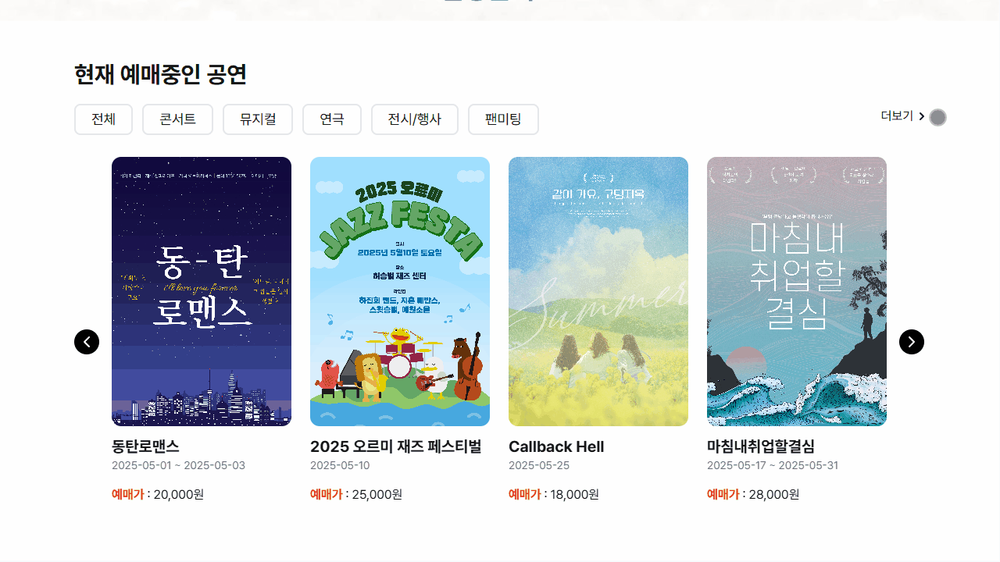 |

#### Header

|                             비회원                             |
| :------------------------------------------------------------: |
|  |

|                                 예매회원                                 |
| :----------------------------------------------------------------------: |
|  |

|                                 공연관리자                                 |
| :------------------------------------------------------------------------: |
|  |

---

### 로그인(`login`)

|                               로그인                               |
| :----------------------------------------------------------------: |
| 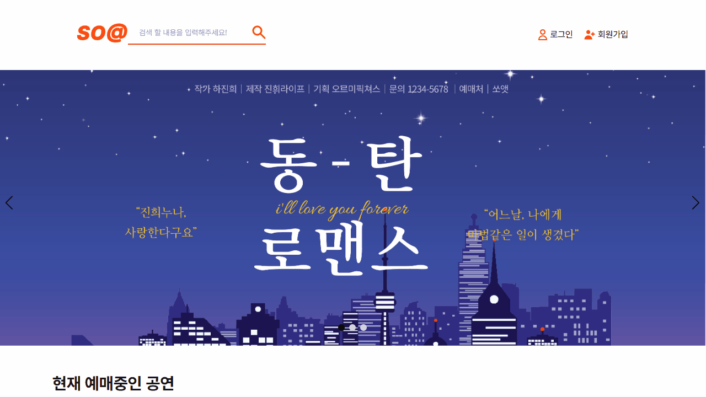 |

### 로그아웃

|                               로그아웃                                |
| :-------------------------------------------------------------------: |
| 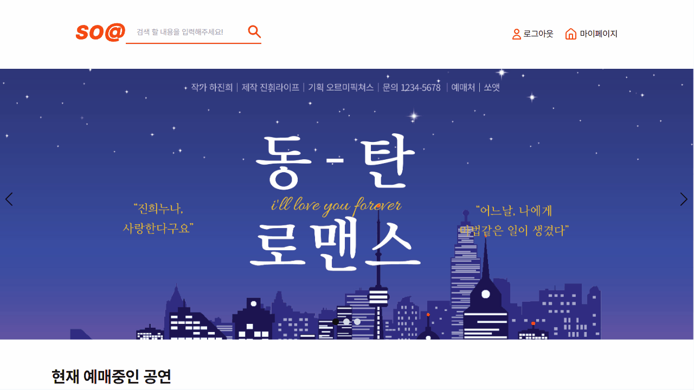 |

---

### 회원가입(`join`)

|                              회원가입                               |
| :-----------------------------------------------------------------: |
|  |

---

#### 상세 페이지(`detail`)

|                           공연 상세페이지                           |
| :-----------------------------------------------------------------: |
| 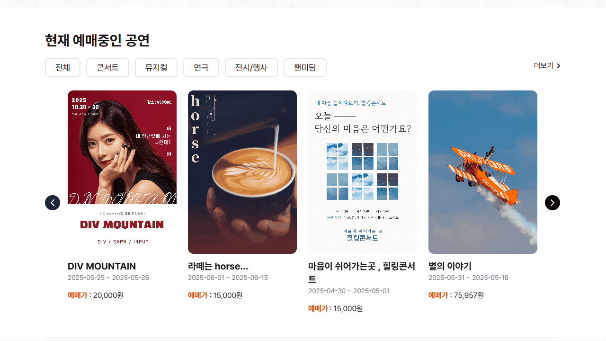 |

|                        공연 링크 공유하기                         |                        공연 위치 확인하기                         |
| :---------------------------------------------------------------: | :---------------------------------------------------------------: |
| 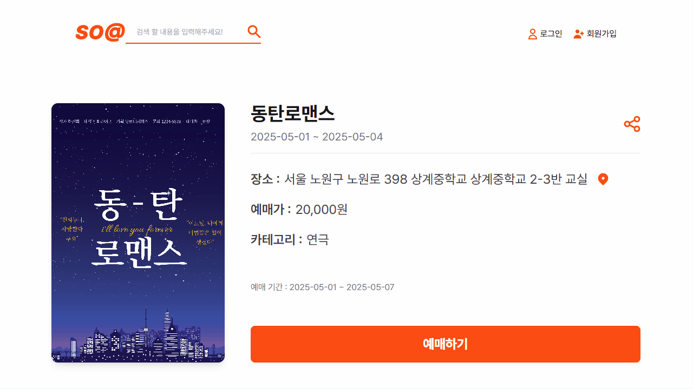 |  |

#### 예매 하기(`reservation`)

|                               예매하기                                |
| :-------------------------------------------------------------------: |
| 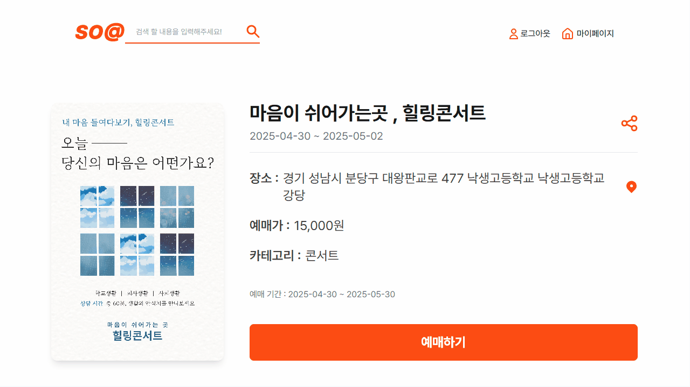 |

|                         예매 불가(예매 시작 전)                         |                       예매 불가(비회원/판매자)                        |
| :---------------------------------------------------------------------: | :-------------------------------------------------------------------: |
| 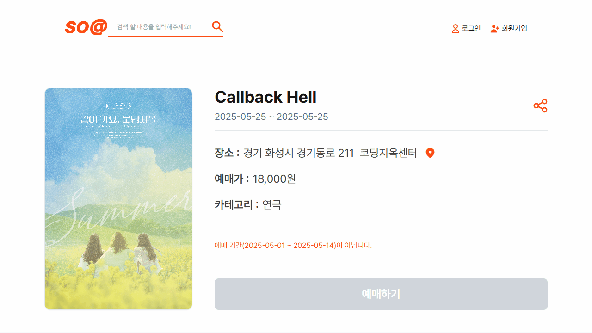 |  |

#### 한줄평 작성하기

|                    한줄평(작성/좋아요/수정/삭제)                    |
| :-----------------------------------------------------------------: |
| 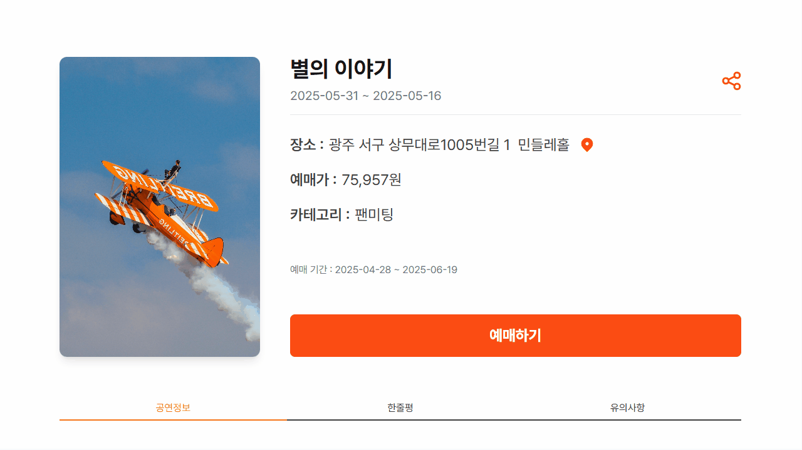 |

### 마이페이지(`account`)

#### 예매내역

|          예매내역 확인 (예정된 예매 / 지난 예매 / 전체 예매)           |
| :--------------------------------------------------------------------: |
|  |

|   예매 상태별(예약 전, 예약 완료 / 환불 대기 / 취소) 예매취소 / QR 티켓 확인    |
| :-----------------------------------------------------------------------------: |
|  |

#### 예매회원 정보 수정

|             예매회원 정보 수정 (비밀번호 변경 / 회원탈퇴)              |
| :--------------------------------------------------------------------: |
| 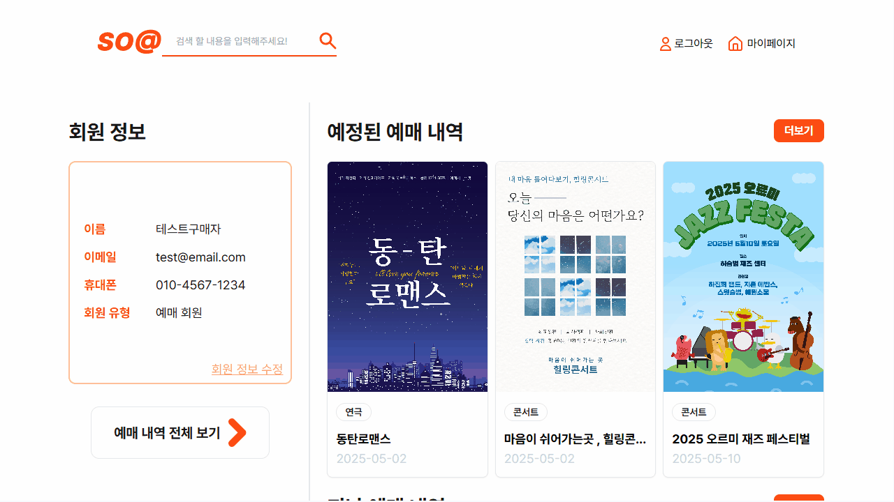 |

### 공연 관리자 페이지(`manager`)

#### 나의 공연 관리

|  등록한 공연내역 확인 (진행중인 공연 / 오픈 예정 공연 / 완료된 공연)   |
| :--------------------------------------------------------------------: |
|  |

|                              공연 취소 및 삭제                              |
| :-------------------------------------------------------------------------: |
| 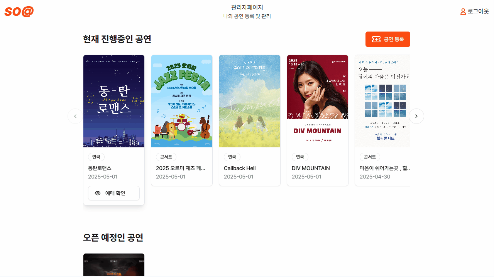 |

|    예매 확인 (좌석별 정보 확인, 입금상태 변경기능, 개별 공연 취소 )    |
| :--------------------------------------------------------------------: |
| 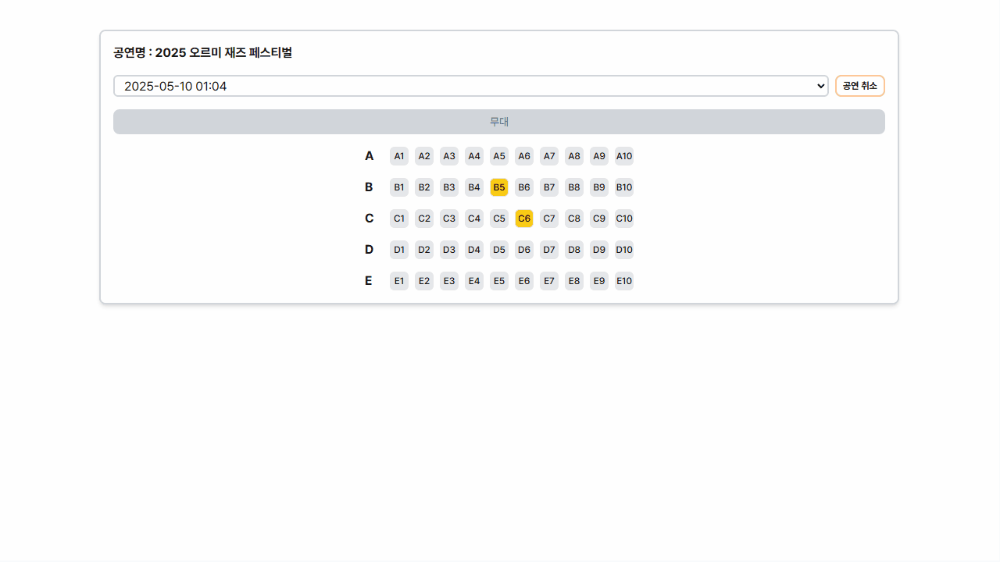 |

#### 공연 등록

|                                 공연 등록                                 |
| :-----------------------------------------------------------------------: |
|  |

|                          작성중인(임시 저장) 공연 등록                          |
| :-----------------------------------------------------------------------------: |
| 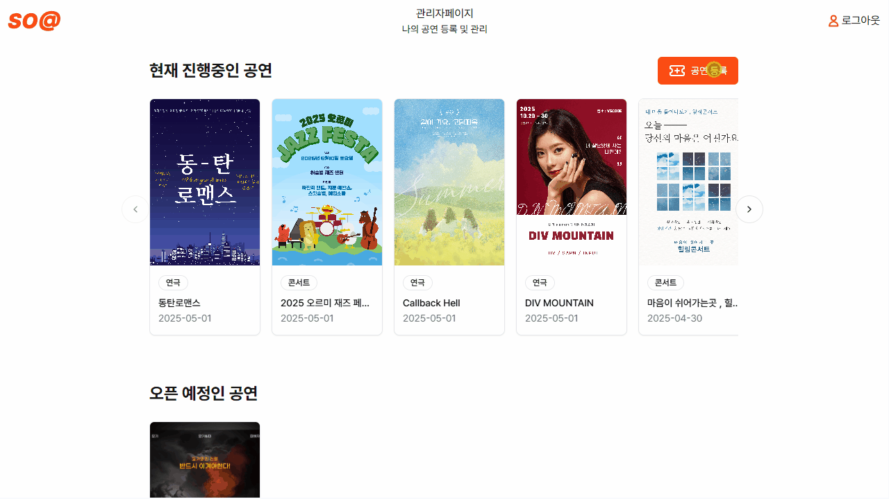 |

#### 공연 QR 티켓 검증

|                              QR 티켓 검증                              |
| :--------------------------------------------------------------------: |
| 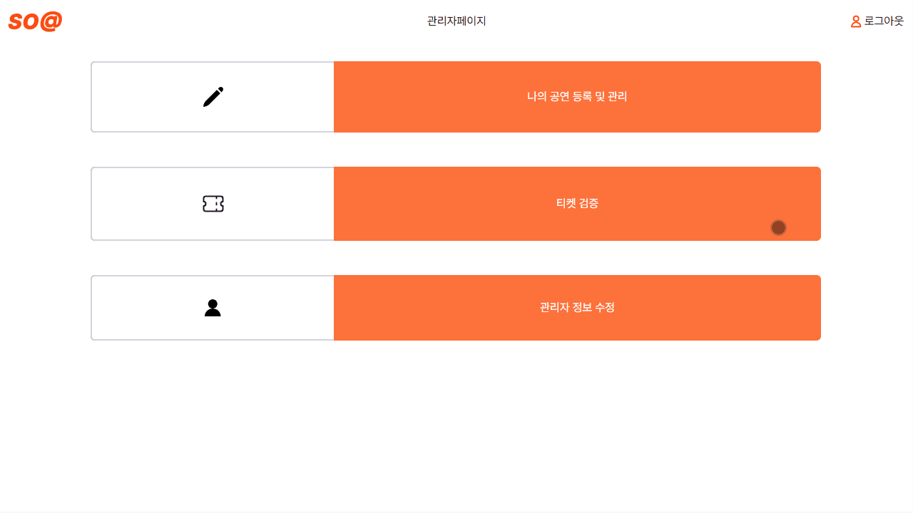 |

|                               티켓 검증 성공                               |               티켓 검증 실패 (미결제 QR : 유효하지 않은 QR)                |
| :------------------------------------------------------------------------: | :------------------------------------------------------------------------: |
|  |  |

#### 공연 관리자회원 정보 수정

|                       공연 관리자회원 정보 수정                        |
| :--------------------------------------------------------------------: |
| 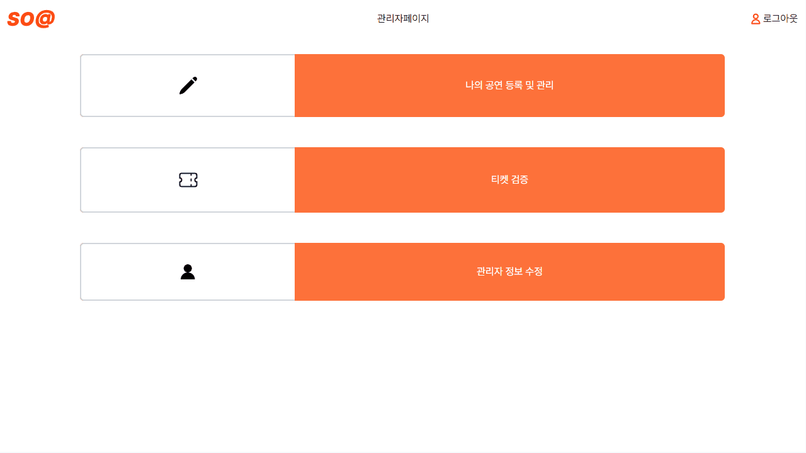 |

### 관리자 페이지(`admin`)

| 현재 UI만 구현된 상태로 2차 개발 기간 중 개발 예정

|       admin (회원관리 / 공연관리 / 컨텐츠관리 / 시스템관리)       |
| :---------------------------------------------------------------: |
| 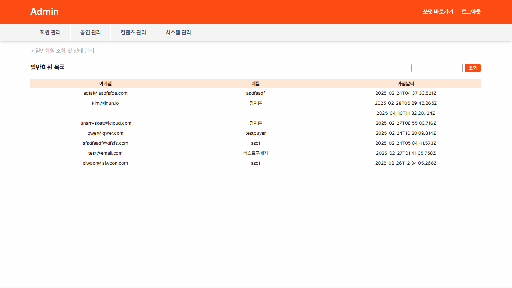 |

## <a name="function"></a> 기능 🛠️

### 로그인(로그아웃)

     - 예매회원 로그인
     - 공연 관리자 로그인
     - 아이디 저장 기능
     - 로그인 유효성 검사 기능
     - 로그아웃 기능

### 회원가입 기능

- 예매회원 회원가입
  - validation 검증 (이메일, 비밀번호, 비밀번호 확인, 이름, 휴대폰 번호)
  - 이메일 인증 기능
- 공연 관리자 회원가입

  - validation 검증 (이메일, 비밀번호, 비밀번호 확인, 팀명, 관리자명, 휴대폰 번호, 계좌번호, 예금주, 사업자등록번호)
  - 이메일 인증 기능
  - 사업자등록번호 인증 기능

- 가입 후 사용자 유형에 따른 인사

### 검색 기능

- 공연 검색 기능 (공연명, 팀명, 공연 내용 등)
  - 정렬 기능 ( 최근날짜순, 한줄평순, 낮은가격순 )
  - 검색 옵션 ( 카테고리, 판매상태 ) 선택 및 초기화 기능
  - 페이지네이션 기능
- 카테고리 검색 기능

### 예매 회원

#### 공연 예매 / 조회 / 취소 기능

- 공연 정보 조회
- 공연 한줄평 조회
- 서비스 유의사항 조회
- 공연 URL 공유기능 , URL 복사기능
- 공연장소 네이버 지도 연동
- 예매 QR 티켓 확인

#### 관람한 공연 한줄평 작성 / 수정 / 삭제 기능

- 공연별 한줄평 리스트 조회
- 한줄평 작성 기능 (별점 , 텍스트)
- 한줄평 평점순 , 공감순 최신글순 필터 기능
- 한줄평 좋아요 기능
- 한줄평 수정 기능
- 한줄평 삭제 기능

#### 예매 내역 확인

- 예매 내역 조회 (예정 / 관람 완료 / 전체)
  - 예매 상세 내역 조회 (예매 정보, 결제 정보)
    - 예매 QR 티켓 확인 기능 (예매 상태에 따라 toast 알림)
    - 예매 취소 기능

#### 마이페이지 회원 조회/수정 기능

- 예매 회원 정보 조회
- 회원 정보 수정
  - 수정 전 현재 비밀번호 확인 기능
  - 비밀번호 변경 기능
    - validation 검증 (새 비밀번호, 비밀번호 확인)
  - 회원탈퇴 기능

### 공연 관리자 회원

#### 공연 등록 / 조회 / 종료 기능

- 등록된 공연 조회 (현재 진행중 / 오픈 예정 / 완료)
  - 공연별 예약 현황 확인 (날짜, 시간별 조회)
    - 좌석 정보 확인 기능 ( 공연 정보 / 예약 정보 / 결제 정보 )
    - 예약 상태 변경 기능
  - 공연별 취소 기능

#### 예매 QR 티켓 검증 기능

#### 관리자 페이지 회원 수정 기능

- 공연 관리자 정보 조회
- 회원 정보 수정 (팀명, 관리자명, 이메일)
  - 이메일 인증 기능
  - 이메일, 팀명, 관리자명 validation 검증

### admin 회원 (UI 구현 완료)

#### 회원 조회 및 상태 관리 (예매 회원 / 공연 관리자 회원 / 관리자 )

- 예매 회원 관리

  - 예매 회원 정보 및 예매 내역 조회
  - 계정 상태 변경 (활성화, 정지, 휴면, 탈퇴)
  - 계정을 관리자(admin) 권한으로 변경
  - 예매 회원 검색 기능

- 공연 관리자 회원 관리

  - 공연 관리자 정보 및 등록 공연 목록 조회
  - 계정 상태 변경 (활성화, 정지, 휴면, 탈퇴)
  - 가입 유형 변경 (개인 ↔ 사업자)
  - 공연 관리자 회원 검색 기능

- 관리자(admin) 관리

  - 관리자 정보 조회
  - 권한 변경 (전체권한, 일부권한, 읽기전용)
  - 신규 관리자 등록
  - 관리자 검색 기능

#### 신규 소극장 관리자 승인

- 신규 가입한 소극장 관리자 정보 확인
- 가입 승인 또는 거절 기능 제공

#### 공연 조회 및 상태 관리

- 공연 상세 정보 및 신고 내역 조회
- 공연 판매 상태 변경 (판매 중, 판매 예정, 판매 종료)
- 공연 노출 설정 (웹에 표시 또는 숨김)
- 공연 검색 기능

#### 한줄평 조회 및 상태 관리

- 한줄평 내용, 작성자 정보, 신고 내역 확인
- 한줄평 노출 설정 (표시 또는 숨김)

#### 배너 관리

- 배너 목록 확인 및 신규 배너 등록
- 배너 수정 및 활성화/비활성화 설정
- 배너 표시 순서 변경 기능

#### 이용약관 / 개인정보 처리방침 관리

- 현재 적용 중인 이용약관 및 개인정보 처리방침 확인
- 내용 수정 기능 제공

#### 서비스 점검 모드 설정

- 페이지 단위로 점검(공사중) 모드 또는 정상 운영 모드 설정 기능

## <a name="troubleShooting"></a>트러블 슈팅 🚀

### 김지훈

### 김예원

### 윤시운

### 이휘경

### 하진희
